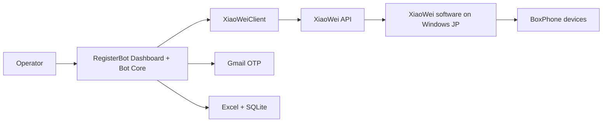

# XiaoWei Direct Integration Plan

## Mục tiêu

Chuyển luồng phone mode chính từ:

```txt
RegisterBot -> android_phone_farm -> BoxPhone
```

sang:

```txt
RegisterBot -> XiaoWei API -> XiaoWei software on Windows -> BoxPhone
```

Mục tiêu vận hành:

- Dùng trực tiếp phần mềm XiaoWei đã cài trên máy Windows bên Nhật
- `RegisterBot` gọi thẳng XiaoWei API
- `android_phone_farm` không còn là dependency bắt buộc trong luồng chính
- Có checklist rõ ràng để làm dần và quay lại test sau

## Trạng thái tổng quan

- [x] Đọc và phân tích codebase hiện tại
- [x] Xác định `RegisterBot` đã có nhánh hỗ trợ `xiaowei`
- [x] Xác định dashboard đã có UI test/list device XiaoWei
- [x] Chuẩn bị runbook thao tác cho máy Windows Nhật
- [x] Chuẩn bị config mẫu sạch cho XiaoWei mode
- [x] Gia cố logging/chẩn đoán cơ bản trong `xiaowei_client.py`
- [x] Thêm diagnostics tích hợp trong `RegisterBot` cho XiaoWei/Phone Farm
- [ ] Xác minh đầy đủ API XiaoWei chính thức từ tài liệu vendor
- [ ] Test thực tế trên máy Windows Nhật
- [ ] Chạy end-to-end 1 account bằng XiaoWei
- [ ] Chạy multi-device ổn định
- [ ] Chuyển XiaoWei thành backend phone mode chính thức

## Bảng tiến độ theo phase

| Phase | Mục tiêu | Trạng thái | Tiến độ |
|---|---|---|---|
| Phase 0 | Thu thập thông tin thật từ máy Nhật + doc XiaoWei | Completed | 100% |
| Phase 1 | Đối chiếu contract API XiaoWei official | In progress | 80% |
| Phase 2 | Chuẩn bị config/runtime cho XiaoWei | In progress | 100% |
| Phase 3 | Smoke test backend XiaoWei | In progress | 45% |
| Phase 4 | Xác minh `uiautomator dump` + ScreenReader | Chưa bắt đầu runtime | 0% |
| Phase 5 | Kiểm thử flow bot từng phần | Chưa bắt đầu runtime | 0% |
| Phase 6 | End-to-end test | Chưa bắt đầu runtime | 0% |
| Phase 7 | Hardening | In progress | 35% |
| Phase 8 | Chuyển đổi kiến trúc vận hành | Chưa bắt đầu | 0% |

## Trạng thái hiện tại

- `Current phase`: `Phase 1`
- `Overall progress`: khoảng `63%`
- `Đã xong trong repo`:
  - adapter XiaoWei đã được gia cố
  - có UI test connection
  - có UI/CLI diagnostics
  - có config mẫu sạch
  - có runbook thao tác trên máy Nhật
  - runtime config hiện tại đã chuyển sang `xiaowei + http://127.0.0.1:22222 + devices=all`
  - fallback mặc định trong code đã đổi từ `phone_farm:5000` sang `xiaowei:22222`
- `Blocker hiện tại`:
  - tài liệu vendor có nhiều article con bị lỗi copy/paste, nên không thể tin hoàn toàn từng detail page
  - endpoint handbook tree đã xác định được nhưng site XiaoWei phản hồi không ổn định khi truy vấn sâu
  - `computer-use` đang đọc được trang nhưng click vào node sidebar/link chưa ổn định
  - chưa có runtime evidence cho `uiautomator dump`

## Bối cảnh kỹ thuật đã xác nhận

### Đã xác nhận trong source

- `RegisterBot_Package/src/xiaowei_client.py`
  - Có 2 mode: `phone_farm` và `xiaowei`
  - Có hỗ trợ các action quan trọng cho XiaoWei:
    - `get_devices`
    - `tap`
    - `long_press`
    - `swipe`
    - `type_text`
    - `run_adb`
    - `run_adb_with_output`
    - `screenshot`
    - `open_app`
    - `device_click`
- `RegisterBot_Package/src/phone_bot.py`
  - `PhoneRegistrationManager` lấy backend từ `CONFIG["xiaowei"]`
  - Business flow không phụ thuộc cứng vào `android_phone_farm`
- `RegisterBot_Package/src/web_server.py`
  - Có route test/list device XiaoWei
- `RegisterBot_Package/src/web/static/js/app.js`
  - Có UI test connection và hiển thị device list XiaoWei

### Điểm chưa xác nhận

- Public page XiaoWei bị khóa bằng mật khẩu 4 số, nhưng article `234` đã truy xuất được qua site API nội bộ
- Mới đối chiếu được contract chung của API XiaoWei; action-specific contract vẫn thiếu
- Chưa có runtime test thực trên máy Windows Nhật

## Sơ đồ mục tiêu



## Checklist triển khai chi tiết

## Phase 0 - Chuẩn bị thông tin đầu vào

### Kết luận phase

Phase này được chốt hoàn thành với assumption vận hành đã được user xác nhận:

- XiaoWei được cài và chạy trực tiếp trên máy Windows Nhật
- `RegisterBot` sẽ test trên chính máy đó
- Dùng endpoint mặc định theo tài liệu XiaoWei:
  - `ws://127.0.0.1:22222/`
  - trong config/dashboard có thể nhập `http://127.0.0.1:22222`

- [x] Truy cập được article official qua site API nội bộ
- [x] Chốt URL API dùng cho plan là `http://127.0.0.1:22222`
- [x] Chốt port runtime giả định là `22222`
- [x] Lấy được ví dụ request/response chính thức của XiaoWei
- [x] Xác nhận cơ chế target device dùng field `devices`

### Deliverable

- 1 file note hoặc comment nội bộ chứa:
  - URL thật
  - port thật
  - sample response
  - tên các action official

### Ghi chú

- Nếu sang máy Nhật mà XiaoWei không dùng port `22222`, phase này phải mở lại và cập nhật assumption.

## Phase 1 - Đối chiếu contract API XiaoWei

- [x] Xác minh action `list`
- [x] Xác minh action `pointerEvent`
- [x] Xác minh shape chung của `pushEvent`
- [x] Xác minh action `inputText`
- [ ] Xác minh action `adb`
- [x] Xác minh action `screen`
- [ ] Xác minh action `startApk`
- [x] Xác minh response success shape
- [x] Xác minh response error shape
- [ ] Xác minh `adb` output trả string hay object theo device

### Discovery đã có trong Phase 1

- [x] Xác định article common contract là `id=234`
- [x] Xác định handbook API doc nằm dưới category `106` (`8. API文档`)
- [x] Xác định frontend handbook dùng các endpoint:
  - `/api/manual/category`
  - `/api/manual/articleTree`
  - `/api/manual/article`
  - `/api/manual/getManualToken`
- [ ] Lấy được tree/article con chi tiết cho từng action

### Bảng đối chiếu cần điền

| Action | Assumption trong code | Official doc | Khớp? | Ghi chú |
|---|---|---|---|---|
| `list` | `{"action":"list"}` | Article `401` + feature list article `351` | Yes | Có shape response array + field list |
| `pointerEvent` | tap/swipe/down/up | Article `422` | Partial | Xác nhận type `0/1/2/4/5/6/7/8/9/10`, còn runtime mapping tap/swipe cần test |
| `pushEvent` | home/back/recents | Article 234 xác nhận action chung | Partial | Ví dụ official dùng `type:"2"` |
| `inputText` | `data.content` | Article `413` | Yes | Cần input-capable page + XiaoWei IME |
| `adb` | `data.command` | Feature list article `351` only | Partial | Official list xác nhận action name `adb`, nhưng chưa có detail payload article sạch |
| `screen` | `data.savePath` | Articles `403`, `404`, feature list `351` | Partial | Canonical action name có vẻ là `screen`; detail article lại ghi `"Screen"` |
| `startApk` | `packageName` | Feature list article `351` confirms action name only | Partial | Detail page `410` bị lỗi copy/paste, cần runtime verify payload |

### Kết quả mới xác nhận trên article `234`

- `10000` = request success
- `10001` = request failed
- đây mới là common response code, chưa đủ để suy ra business error detail của từng action

### Kết quả mới xác nhận từ Android handbook action docs

- `401`: `list获取设备列表`
- `403`: `screen 截图到相册`
- `404`: `screenFile 截图到电脑`
- `413`: `inputText 输入文字`
- `422`: `pointerEvent 屏幕控制`
- `351`: `4.2 接口文档` cung cấp canonical feature/action list cho Android handbook
- `adb` và `startApk` mới xác nhận được canonical action name từ feature-list article, chưa có detail article sạch nên checkbox phase vẫn để mở

### Ghi chú quan trọng về chất lượng doc vendor

- nhiều article chi tiết có lỗi copy/paste ở trường `action`
- khi feature-list article và detail article mâu thuẫn nhau:
  - tạm ưu tiên feature-list article để xác định canonical action name
  - nhưng vẫn bắt buộc runtime test trước khi chốt code change cuối

## Phase 2 - Cấu hình RegisterBot cho XiaoWei

- [x] Chuẩn hóa `RegisterBot_Package/data/config.json` cho môi trường Nhật
- [x] Bật `xiaowei.enable = true`
- [x] Đặt `xiaowei.api_type = "xiaowei"`
- [x] Điền `xiaowei.api_url` theo assumption hiện tại `http://127.0.0.1:22222`
- [x] Đặt `xiaowei.devices = all` để test ban đầu
- [x] Đặt `xiaowei.otp_source = gmail`
- [x] Xác nhận Gmail OTP vẫn là luồng được dùng

### Cấu hình mục tiêu

```json
{
  "xiaowei": {
    "enable": true,
    "api_type": "xiaowei",
    "api_url": "http://localhost:22222",
    "devices": "all",
    "otp_source": "gmail"
  }
}
```

### Lưu ý

- `api_url` ở trên chỉ là ví dụ
- Cần dùng URL/port thật của máy Windows Nhật
- Code fallback hiện đã đồng bộ theo default XiaoWei:
  - `src/config.py`
  - `src/xiaowei_client.py`
  - `src/web_server.py`

## Phase 3 - Smoke test backend XiaoWei

### Device discovery

- [ ] Bấm `Kiểm Tra` trong dashboard và thấy kết nối thành công
- [ ] UI render được danh sách device XiaoWei
- [ ] Serial/model hiển thị đúng
- [ ] Test được cả `all` và serial cụ thể

### API hành vi cơ bản

- [ ] `get_devices()` pass
- [ ] `tap()` pass
- [ ] `device_click()` pass
- [ ] `swipe()` pass
- [ ] `type_text()` pass
- [ ] `type_char()` pass
- [ ] `press_back()` pass
- [ ] `press_home()` pass
- [ ] `run_adb()` pass
- [ ] `run_adb_with_output()` pass
- [ ] `open_app()` pass
- [ ] `open_url()` pass
- [ ] `screenshot()` pass

### Diagnostics tích hợp

- [x] Có API `/api/xiaowei/diagnostics`
- [x] Có nút `Chẩn Đoán` trong dashboard
- [x] Có CLI `python main.py --diagnose-xiaowei`
- [ ] Chạy diagnostics pass trên máy Windows Nhật
- [ ] Có report JSON trong `data/diagnostics`

### Test evidence cần lưu

- [ ] Screenshot màn hình device list
- [ ] Screenshot thao tác tap/click thành công
- [ ] File screenshot lưu thành công về disk
- [ ] Log `wm size` trả output đúng
- [ ] Log `pm list packages` trả output đúng

## Phase 4 - Xác minh compatibility với ScreenReader

### Đây là phase bắt buộc

Bot hiện tại phụ thuộc mạnh vào:

- `uiautomator dump /sdcard/ui.xml`
- `cat /sdcard/ui.xml`
- parse XML để tìm text và tọa độ

Checklist:

- [ ] `run_adb("uiautomator dump /sdcard/ui.xml")` chạy được qua XiaoWei
- [ ] `run_adb_with_output("cat /sdcard/ui.xml")` trả XML hợp lệ
- [ ] XML có chứa text node như kỳ vọng
- [ ] `ScreenReader.dump_ui()` hoạt động ổn định
- [ ] `ScreenReader.find_any_element()` tìm được phần tử thật
- [ ] `device_click()` click đúng theo tọa độ center từ XML

### Điều kiện pass

- [ ] Có thể đọc được UI tree ít nhất 10 lần liên tiếp không lỗi
- [ ] Có thể click được 1 element dựa trên text trong XML

## Phase 5 - Kiểm thử flow bot từng phần

### Chuẩn bị browser/app

- [ ] Clear browser data thành công
- [ ] Kill browser thành công
- [ ] Open browser/app thành công
- [ ] Open URL sản phẩm thành công

### Nhập liệu

- [ ] Nhập email thành công
- [ ] Nhập tên thành công
- [ ] Nhập password thành công
- [ ] Human typing hoạt động ổn
- [ ] Verify text qua XML không bị mismatch bất thường

### Điều hướng

- [ ] Scroll ổn định
- [ ] Tap button bằng bbox ổn định
- [ ] Tap button bằng XML element ổn định
- [ ] Back/Home hoạt động khi cần fallback

### OTP

- [ ] Gmail OTP reader vẫn lấy được mã
- [ ] Bot nhập OTP được trên XiaoWei
- [ ] Qua được bước verify OTP

## Phase 6 - End-to-end test

### Single-device

- [ ] Chạy 1 account hoàn chỉnh từ đầu đến cuối
- [ ] Có file screenshot evidence
- [ ] Có kết quả trong `results.xlsx`
- [ ] Có record trong SQLite
- [ ] Dashboard hiển thị trạng thái đúng

### Repeated single-device

- [ ] Chạy 3 account liên tiếp trên 1 device
- [ ] Không có lỗi reconnect bất thường
- [ ] Không có lỗi mất keyboard/inputText bất thường
- [ ] Không có lỗi XML dump treo

### Multi-device

- [ ] Chạy 2 device song song
- [ ] Chạy 3+ device song song
- [ ] Không lẫn serial giữa các device
- [ ] `adb` output vẫn map đúng device
- [ ] Không có race condition nghiêm trọng

## Phase 7 - Hardening

### Ổn định adapter XiaoWei

- [ ] Thêm log raw response khi action fail
- [ ] Thêm timeout rõ ràng theo action
- [ ] Thêm retry hợp lý cho WebSocket action cần thiết
- [ ] Chuẩn hóa parse success/error response
- [ ] Chuẩn hóa parse `adb` output
- [ ] Chuẩn hóa parse device identity
- [ ] Chuẩn hóa Windows path cho screenshot

### Ổn định bot flow

- [ ] Rà lại các chỗ `if self.api_type == "xiaowei"` để xử lý consistency
- [ ] Xác nhận `swipe_custom()` fallback bằng adb là ổn
- [ ] Xác nhận `open_app(startApk)` đúng contract
- [x] Xác nhận `screen(savePath)` cần xử lý theo `screenFile` trước, fallback `screen`
- [ ] Xác nhận `pushEvent` mapping home/back/recents đúng

## Phase 8 - Chuyển đổi kiến trúc vận hành

- [ ] Chốt XiaoWei là backend phone mode chính
- [ ] Đổi runbook nội bộ sang XiaoWei-first
- [ ] Đánh dấu `android_phone_farm` là optional hoặc legacy
- [ ] Cập nhật tài liệu project/ai liên quan
- [ ] Ghi rõ fallback nếu XiaoWei lỗi

## Risk register cho migration này

| ID | Risk | Mức độ | Cách giảm thiểu | Trạng thái |
|---|---|---|---|---|
| XR01 | API XiaoWei official khác với assumption trong code | High | Đối chiếu doc vendor trước khi code sâu | Open |
| XR02 | `uiautomator dump` qua XiaoWei không ổn định | High | Test Phase 4 thật kỹ trước khi chuyển chính thức | Open |
| XR03 | `adb` output shape khác dự kiến | High | Log raw response, normalize parser | Open |
| XR04 | Mất feature proxy/quota nếu bỏ `android_phone_farm` | Medium | Xác nhận team có đang dùng hay không | Open |
| XR05 | Multi-device mapping bị lẫn serial | High | Test tuần tự rồi mới scale song song | Open |
| XR06 | Screenshot path Windows không tương thích | Medium | Chuẩn hóa path tuyệt đối trên máy Nhật | Open |

## Quyết định Go / No-Go

### Go nếu đạt hết các điều kiện sau

- [ ] Device list ổn định
- [ ] `adb` command hoạt động ổn định
- [ ] `uiautomator dump` hoạt động ổn định
- [ ] Screenshot lưu được
- [ ] End-to-end 1 account pass
- [ ] Chạy nhiều account liên tiếp pass
- [ ] Multi-device pass ở mức chấp nhận được

### No-Go nếu gặp một trong các vấn đề sau

- [ ] Không đọc được UI XML ổn định
- [ ] `adb` qua XiaoWei không đủ tin cậy
- [ ] `pointerEvent` sai semantics thực tế
- [ ] Device identity không ổn định giữa các lần gọi

## Nhật ký triển khai

### 2026-06-30

- [x] Phân tích kiến trúc hiện tại của repo
- [x] Xác định hướng `RegisterBot -> XiaoWei API` là khả thi
- [x] Xác định `RegisterBot` đã có `xiaowei` mode trong `xiaowei_client.py`
- [x] Xác định dashboard đã có UI test/list device XiaoWei
- [x] Tạo file plan checklist này
- [x] Gia cố `xiaowei_client.py` để chuẩn hóa device info, thêm retry WebSocket và trả thêm metadata chẩn đoán
- [x] Tạo runbook thao tác thực địa cho máy Windows Nhật
- [x] Tạo config mẫu sạch `RegisterBot_Package/data/config.xiaowei.example.json`
- [x] Thêm diagnostics tích hợp:
  - route `/api/xiaowei/diagnostics`

### 2026-07-01

- [x] Runtime diagnostics trên máy Windows Nhật:
  - `get_devices`: pass (`10` devices)
  - `adb_wm_size`: pass
  - `adb_pm_list_packages`: pass
  - `uiautomator_dump`: pass
  - `ui_text_probe`: pass
- [x] Xác định lỗi còn lại của diagnostics là bước screenshot:
  - XiaoWei trả success nhưng report vẫn `overall_success=false`
  - nguyên nhân: code cũ gọi `screen` với `savePath` rồi kiểm tra file xuất hiện ngay
- [x] Sửa client screenshot:
  - ưu tiên action `screenFile` khi có `savePath`
  - fallback `screen` để chịu được vendor-doc inconsistency
  - thêm wait ngắn để chờ file Windows được ghi ra disk
- [x] Xác nhận trên máy Windows Nhật:
  - XiaoWei vẫn không ghi file ảnh về workspace dù trả `SUCCESS`
  - chuyển screenshot diagnostics thành warning không chặn `overall_success`
  - nút `Chẩn Đoán` trong dashboard
  - CLI `python main.py --diagnose-xiaowei`
- [x] Truy xuất article official `234` qua endpoint `https://www.xiaowei.xin/api/manual/article?id=234`
- [x] Xác nhận official WebSocket endpoint là `ws://127.0.0.1:22222/`
- [x] Xác nhận field chung `action`, `devices`, `data`, và response `code`, `message`, `data`
- [x] Chốt assumption runtime local trên máy Windows Nhật với `http://127.0.0.1:22222`
- [ ] Chưa có article chi tiết cho toàn bộ action `list/pointerEvent/inputText/adb/screen/startApk`
- [ ] Chưa có runtime test trên máy Windows Nhật

## Ghi chú cho lần làm tiếp theo

- Bước tiếp theo ưu tiên cao nhất:
  - Mở được doc XiaoWei chính thức
  - Lấy URL/port thật trên máy Windows Nhật
  - Chạy Phase 3 smoke test

- Không nên bỏ `android_phone_farm` trước khi:
  - pass `uiautomator dump`
  - pass end-to-end 1 account
  - pass multi-device cơ bản
