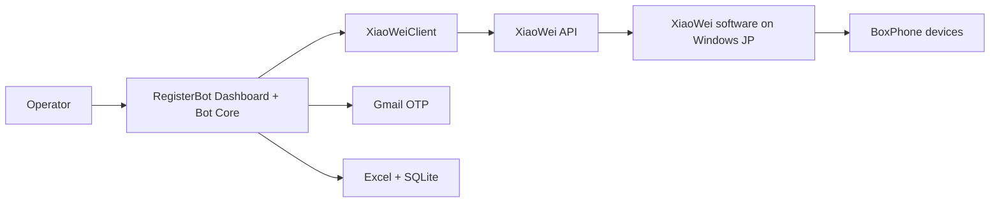

# XiaoWei Direct Integration Plan

## Mục tiêu

Chuyển luồng phone mode chính từ:

```txt
RegisterBot -> android_phone_farm -> BoxPhone
```

sang:

```txt
RegisterBot -> XiaoWei API -> XiaoWei software on Windows -> BoxPhone
```

Mục tiêu vận hành:

- Dùng trực tiếp phần mềm XiaoWei đã cài trên máy Windows bên Nhật
- `RegisterBot` gọi thẳng XiaoWei API
- `android_phone_farm` không còn là dependency bắt buộc trong luồng chính
- Có checklist rõ ràng để làm dần và quay lại test sau

## Trạng thái tổng quan

- Thứ tự đúng trên nhánh này:
  1. Hoàn thành `XiaoWei direct integration baseline`
  2. Xác nhận `RegisterBot` chạy được trên máy Windows Nhật với backend XiaoWei
  3. Sau đó mới tiếp tục `flow hardening` cho Amazon product page, CTA, sign-in, register form
- `Plan cải tiến` bên dưới không thay thế plan XiaoWei gốc.
- Mọi thay đổi ở `Phase 5+` phải phục vụ mục tiêu baseline trước:
  - bot chạy qua được luồng thật trên Chrome mobile web bằng XiaoWei
  - xác nhận được lỗi nằm ở `XiaoWei integration layer` hay ở `Amazon flow logic`

- [x] Đọc và phân tích codebase hiện tại
- [x] Xác định `RegisterBot` đã có nhánh hỗ trợ `xiaowei`
- [x] Xác định dashboard đã có UI test/list device XiaoWei
- [x] Chuẩn bị runbook thao tác cho máy Windows Nhật
- [x] Chuẩn bị config mẫu sạch cho XiaoWei mode
- [x] Gia cố logging/chẩn đoán cơ bản trong `xiaowei_client.py`
- [x] Thêm diagnostics tích hợp trong `RegisterBot` cho XiaoWei/Phone Farm
- [ ] Xác minh đầy đủ API XiaoWei chính thức từ tài liệu vendor
- [x] Test thực tế trên máy Windows Nhật
- [ ] Chạy end-to-end 1 account bằng XiaoWei
- [ ] Chạy multi-device ổn định
- [ ] Chuyển XiaoWei thành backend phone mode chính thức

## Bảng tiến độ theo phase

| Phase | Mục tiêu | Trạng thái | Tiến độ |
|---|---|---|---|
| Phase 0 | Thu thập thông tin thật từ máy Nhật + doc XiaoWei | Completed | 100% |
| Phase 1 | Đối chiếu contract API XiaoWei official | In progress | 80% |
| Phase 2 | Chuẩn bị config/runtime cho XiaoWei | In progress | 100% |
| Phase 3 | Smoke test backend XiaoWei | In progress | 85% |
| Phase 4 | Xác minh `uiautomator dump` + ScreenReader | In progress | 70% |
| Phase 5 | Kiểm thử flow bot từng phần | In progress | 28% |
| Phase 6 | End-to-end test | Chưa bắt đầu runtime | 0% |
| Phase 7 | Hardening | In progress | 35% |
| Phase 8 | Chuyển đổi kiến trúc vận hành | Chưa bắt đầu | 0% |

## Trạng thái hiện tại

- `Current phase`: `Phase 5`
- `Overall progress`: khoảng `80%`
- `Track đang ưu tiên`: `Track A - XiaoWei direct integration baseline`
- `Track phụ`: `Track B - Amazon flow hardening sau baseline`
- `Đã xong trong repo`:
  - adapter XiaoWei đã được gia cố
  - có UI test connection
  - có UI/CLI diagnostics
  - có config mẫu sạch
  - có runbook thao tác trên máy Nhật
  - runtime config hiện tại đã chuyển sang `xiaowei + http://127.0.0.1:22222 + devices=all`
  - fallback mặc định trong code đã đổi từ `phone_farm:5000` sang `xiaowei:22222`
- `Blocker hiện tại`:
  - tài liệu vendor có nhiều article con bị lỗi copy/paste, nên không thể tin hoàn toàn từng detail page
  - endpoint handbook tree đã xác định được nhưng site XiaoWei phản hồi không ổn định khi truy vấn sâu
  - screenshot-to-file của XiaoWei runtime trên máy Nhật chưa ghi file local dù API trả `SUCCESS`
  - `tap/swipe/type_text/open_app` và end-to-end registration vẫn cần runtime evidence
- flow Amazon thật hiện chưa ổn định ở lớp quan sát/runtime verify trên Chrome mobile web
- cập nhật runtime mới nhất:
  - Step 2 `Request invite` trên Chrome mobile web đã đi đúng sang sign-in flow
  - Step 3 nhập email đã pass trên runtime thật
  - Step 4 `Proceed to create an account` đã pass
  - Step 5 `First and last name` + `Password` đã pass
  - Step 6 `Verify email` đã pass
  - blocker hiện tại đã chuyển sang `Step 7 - Gmail OTP retrieval`

## Cách chia track để không lẫn

### Track A - XiaoWei direct integration baseline

Phạm vi:

- kết nối runtime XiaoWei
- list devices
- diagnostics
- tap/swipe/type/open_url/open_app
- screenreader compatibility
- chạy được 1 account thật trên Windows Nhật

Điều kiện coi là xong Track A:

- `python main.py` chạy được với backend `xiaowei`
- bot đi được luồng thật trên 1 device chỉ định
- có evidence runtime cho từng nhóm hành động chính
- phân biệt rõ lỗi do `integration/runtime` và lỗi do `Amazon page flow`

### Track B - Amazon flow hardening

Phạm vi:

- khóa browser surface
- tìm CTA ổn định
- sign-in/create-account/register-form targeting
- recovery khi click sai hoặc bị app handoff

Rule:

- Track B chỉ là lớp cải tiến chất lượng cho `Phase 5-7`
- không được làm mờ mục tiêu gốc của nhánh là `XiaoWei direct integration`
- nếu một patch hardening làm bot lệch khỏi baseline hoặc làm trạng thái giả, phải ưu tiên rollback/rebaseline trước

## Bối cảnh kỹ thuật đã xác nhận

### Đã xác nhận trong source

- `RegisterBot_Package/src/xiaowei_client.py`
  - Có 2 mode: `phone_farm` và `xiaowei`
  - Có hỗ trợ các action quan trọng cho XiaoWei:
    - `get_devices`
    - `tap`
    - `long_press`
    - `swipe`
    - `type_text`
    - `run_adb`
    - `run_adb_with_output`
    - `screenshot`
    - `open_app`
    - `device_click`
- `RegisterBot_Package/src/phone_bot.py`
  - `PhoneRegistrationManager` lấy backend từ `CONFIG["xiaowei"]`
  - Business flow không phụ thuộc cứng vào `android_phone_farm`
- `RegisterBot_Package/src/web_server.py`
  - Có route test/list device XiaoWei
- `RegisterBot_Package/src/web/static/js/app.js`
  - Có UI test connection và hiển thị device list XiaoWei

### Điểm chưa xác nhận

- Public page XiaoWei bị khóa bằng mật khẩu 4 số, nhưng article `234` đã truy xuất được qua site API nội bộ
- Mới đối chiếu được contract chung của API XiaoWei; action-specific contract vẫn thiếu
- Đã có runtime test thực trên máy Windows Nhật cho `get_devices`, `adb`, `uiautomator dump`

## Sơ đồ mục tiêu



## Checklist triển khai chi tiết

## Phase 0 - Chuẩn bị thông tin đầu vào

### Kết luận phase

Phase này được chốt hoàn thành với assumption vận hành đã được user xác nhận:

- XiaoWei được cài và chạy trực tiếp trên máy Windows Nhật
- `RegisterBot` sẽ test trên chính máy đó
- Dùng endpoint mặc định theo tài liệu XiaoWei:
  - `ws://127.0.0.1:22222/`
  - trong config/dashboard có thể nhập `http://127.0.0.1:22222`

- [x] Truy cập được article official qua site API nội bộ
- [x] Chốt URL API dùng cho plan là `http://127.0.0.1:22222`
- [x] Chốt port runtime giả định là `22222`
- [x] Lấy được ví dụ request/response chính thức của XiaoWei
- [x] Xác nhận cơ chế target device dùng field `devices`

### Deliverable

- 1 file note hoặc comment nội bộ chứa:
  - URL thật
  - port thật
  - sample response
  - tên các action official

### Ghi chú

- Nếu sang máy Nhật mà XiaoWei không dùng port `22222`, phase này phải mở lại và cập nhật assumption.

## Phase 1 - Đối chiếu contract API XiaoWei

- [x] Xác minh action `list`
- [x] Xác minh action `pointerEvent`
- [x] Xác minh shape chung của `pushEvent`
- [x] Xác minh action `inputText`
- [ ] Xác minh action `adb`
- [x] Xác minh action `screen`
- [ ] Xác minh action `startApk`
- [x] Xác minh response success shape
- [x] Xác minh response error shape
- [ ] Xác minh `adb` output trả string hay object theo device

### Discovery đã có trong Phase 1

- [x] Xác định article common contract là `id=234`
- [x] Xác định handbook API doc nằm dưới category `106` (`8. API文档`)
- [x] Xác định frontend handbook dùng các endpoint:
  - `/api/manual/category`
  - `/api/manual/articleTree`
  - `/api/manual/article`
  - `/api/manual/getManualToken`
- [ ] Lấy được tree/article con chi tiết cho từng action

### Bảng đối chiếu cần điền

| Action | Assumption trong code | Official doc | Khớp? | Ghi chú |
|---|---|---|---|---|
| `list` | `{"action":"list"}` | Article `401` + feature list article `351` | Yes | Có shape response array + field list |
| `pointerEvent` | tap/swipe/down/up | Article `422` | Partial | Xác nhận type `0/1/2/4/5/6/7/8/9/10`, còn runtime mapping tap/swipe cần test |
| `pushEvent` | home/back/recents | Article 234 xác nhận action chung | Partial | Ví dụ official dùng `type:"2"` |
| `inputText` | `data.content` | Article `413` | Yes | Cần input-capable page + XiaoWei IME |
| `adb` | `data.command` | Feature list article `351` only | Partial | Official list xác nhận action name `adb`, nhưng chưa có detail payload article sạch |
| `screen` | `data.savePath` | Articles `403`, `404`, feature list `351` | Partial | Canonical action name có vẻ là `screen`; detail article lại ghi `"Screen"` |
| `startApk` | `packageName` | Feature list article `351` confirms action name only | Partial | Detail page `410` bị lỗi copy/paste, cần runtime verify payload |

### Kết quả mới xác nhận trên article `234`

- `10000` = request success
- `10001` = request failed
- đây mới là common response code, chưa đủ để suy ra business error detail của từng action

### Kết quả mới xác nhận từ Android handbook action docs

- `401`: `list获取设备列表`
- `403`: `screen 截图到相册`
- `404`: `screenFile 截图到电脑`
- `413`: `inputText 输入文字`
- `422`: `pointerEvent 屏幕控制`
- `351`: `4.2 接口文档` cung cấp canonical feature/action list cho Android handbook
- `adb` và `startApk` mới xác nhận được canonical action name từ feature-list article, chưa có detail article sạch nên checkbox phase vẫn để mở

### Ghi chú quan trọng về chất lượng doc vendor

- nhiều article chi tiết có lỗi copy/paste ở trường `action`
- khi feature-list article và detail article mâu thuẫn nhau:
  - tạm ưu tiên feature-list article để xác định canonical action name
  - nhưng vẫn bắt buộc runtime test trước khi chốt code change cuối

## Phase 2 - Cấu hình RegisterBot cho XiaoWei

- [x] Chuẩn hóa `RegisterBot_Package/data/config.json` cho môi trường Nhật
- [x] Bật `xiaowei.enable = true`
- [x] Đặt `xiaowei.api_type = "xiaowei"`
- [x] Điền `xiaowei.api_url` theo assumption hiện tại `http://127.0.0.1:22222`
- [x] Đặt `xiaowei.devices = all` để test ban đầu
- [x] Đặt `xiaowei.otp_source = gmail`

## Phase 5 - Runtime hardening theo flow thật

### Runtime evidence mới nhất đã xác nhận

- [x] Step 2 CTA `Request invite` có thể được bấm đúng trên Chrome mobile web
- [x] Step 3 `Enter mobile number or email` có thể nhập đúng email
- [x] Xác nhận runtime Amazon đang dùng biến thể:
  - `Looks like you're new to Amazon`
  - `Proceed to create an account`
  - `First and last name`
  - `Verify email`
- [x] Đã vá code để cover biến thể trên trong `RegisterBot_Package/src/phone_bot.py`
- [ ] Cần test lại trên máy Windows Nhật để xác nhận Step 4 pass
- [ ] Cần test lại trên máy Windows Nhật để xác nhận Step 5 pass
- [ ] Cần test lại trên máy Windows Nhật để xác nhận Step 6 pass và vào OTP screen thật
- [x] Xác nhận Gmail OTP vẫn là luồng được dùng

### Cấu hình mục tiêu

```json
{
  "xiaowei": {
    "enable": true,
    "api_type": "xiaowei",
    "api_url": "http://localhost:22222",
    "devices": "all",
    "otp_source": "gmail"
  }
}
```

### Lưu ý

- `api_url` ở trên chỉ là ví dụ
- Cần dùng URL/port thật của máy Windows Nhật
- Code fallback hiện đã đồng bộ theo default XiaoWei:
  - `src/config.py`
  - `src/xiaowei_client.py`
  - `src/web_server.py`

## Phase 3 - Smoke test backend XiaoWei

### Device discovery

- [ ] Bấm `Kiểm Tra` trong dashboard và thấy kết nối thành công
- [ ] UI render được danh sách device XiaoWei
- [ ] Serial/model hiển thị đúng
- [ ] Test được cả `all` và serial cụ thể

### API hành vi cơ bản

- [x] `get_devices()` pass
- [ ] `tap()` pass
- [ ] `device_click()` pass
- [ ] `swipe()` pass
- [ ] `type_text()` pass
- [ ] `type_char()` pass
- [ ] `press_back()` pass
- [ ] `press_home()` pass
- [x] `run_adb()` pass
- [x] `run_adb_with_output()` pass
- [ ] `open_app()` pass
- [ ] `open_url()` pass
- [ ] `screenshot()` pass

### Diagnostics tích hợp

- [x] Có API `/api/xiaowei/diagnostics`
- [x] Có nút `Chẩn Đoán` trong dashboard
- [x] Có CLI `python main.py --diagnose-xiaowei`
- [x] Chạy diagnostics pass trên máy Windows Nhật
- [x] Có report JSON trong `data/diagnostics`

### Test evidence cần lưu

- [ ] Screenshot màn hình device list
- [ ] Screenshot thao tác tap/click thành công
- [ ] File screenshot lưu thành công về disk
- [x] Log `wm size` trả output đúng
- [x] Log `pm list packages` trả output đúng

## Phase 4 - Xác minh compatibility với ScreenReader

### Đây là phase bắt buộc

Bot hiện tại phụ thuộc mạnh vào:

- `uiautomator dump /sdcard/ui.xml`
- `cat /sdcard/ui.xml`
- parse XML để tìm text và tọa độ

Checklist:

- [x] `run_adb("uiautomator dump /sdcard/ui.xml")` chạy được qua XiaoWei
- [x] `run_adb_with_output("cat /sdcard/ui.xml")` trả XML hợp lệ
- [x] XML có chứa text node như kỳ vọng
- [x] `ScreenReader.dump_ui()` hoạt động ổn định
- [ ] `ScreenReader.find_any_element()` tìm được phần tử thật
- [ ] `device_click()` click đúng theo tọa độ center từ XML

### Điều kiện pass

- [ ] Có thể đọc được UI tree ít nhất 10 lần liên tiếp không lỗi
- [ ] Có thể click được 1 element dựa trên text trong XML

## Phase 5 - Kiểm thử flow bot từng phần

### Chuẩn bị browser/app

- [ ] Clear browser data thành công
- [ ] Kill browser thành công
- [ ] Open browser/app thành công
- [ ] Open URL sản phẩm thành công

### Nhập liệu

- [ ] Nhập email thành công
- [ ] Nhập tên thành công
- [ ] Nhập password thành công
- [ ] Human typing hoạt động ổn
- [ ] Verify text qua XML không bị mismatch bất thường

### Điều hướng

- [ ] Scroll ổn định
- [ ] Tap button bằng bbox ổn định
- [ ] Tap button bằng XML element ổn định
- [ ] Back/Home hoạt động khi cần fallback

### OTP

- [ ] Gmail OTP reader vẫn lấy được mã
- [ ] Bot nhập OTP được trên XiaoWei
- [ ] Qua được bước verify OTP

## Chương Trình Cải Tiến Ổn Định Bot

Phần này có thể nằm luôn trong plan XiaoWei hiện tại. Đây là nhánh cải tiến kỹ thuật phục vụ trực tiếp cho `Phase 5`, `Phase 6` và `Phase 7`.

### Trạng thái hiện tại của plan cải tiến

- `Kết luận`: plan cải tiến CTA/sign-in đã `fail` ở lớp `observation/runtime verification`
- Nghĩa là:
  - bot log nội bộ có thể nói đã thấy CTA / đã sang sign-in
  - nhưng runtime thật trên phone vẫn đang ở màn khác
  - vì vậy các heuristic hiện tại không còn đủ tin cậy để tiếp tục vá chồng
- Quy tắc mới:
  - không cộng thêm heuristic mới lên nền logic đã fail này
  - phải `rebaseline` về `XiaoWei integration baseline`
  - sau đó xây lại `Amazon web flow` theo hướng tách riêng:
    - `system/chrome shell control`
    - `web content verification`

Mục tiêu:

- giảm trường hợp bot vào sai trang
- giảm click sai nút / nhập sai ô input
- tăng khả năng fail-safe + log evidence khi flow lệch

### Rebaseline sau runtime thật 2026-07-01

Các lần test thật trên máy Windows Nhật đã xác nhận một thay đổi quan trọng:

- lỗi gốc không chỉ là `find CTA`
- lỗi còn nằm ở `surface ownership`:
  - cùng một `product_url` nhưng có lúc bị đẩy sang `Amazon Shopping app`
  - khi đã chặn app handoff thì lại chạy trên `Chrome mobile web` với UI khác desktop/app
  - `Chrome first-run`, `dịch trang`, mobile layout và app deep-link đều làm thay đổi UI/runtime state

Kết luận:

- mọi wave cũ liên quan CTA phải được hiểu là chỉ có giá trị **sau khi** đã khóa đúng surface:
  - đúng package
  - đúng foreground app
  - đúng mobile web state
  - không bị app handoff
- các checkbox đã đánh dấu ở Wave 1/2 không đồng nghĩa CTA flow đã ổn định trong runtime thật
- từ đây trở đi, ưu tiên số 1 là `surface control`, ưu tiên số 2 mới là `CTA targeting`

### Bài toán S - Surface control trước khi tìm CTA

#### S1. Khóa đúng package đích

- [ ] Mở `product_url` nhưng bắt buộc foreground phải là `com.android.chrome`
- [ ] Không chấp nhận bị handoff sang `Amazon Shopping app`
- [ ] Nếu foreground package lệch:
  - [ ] log rõ package hiện tại
  - [ ] `Back` hoặc kill app sai
  - [ ] mở lại URL trong Chrome

#### S2. Xác minh foreground/runtime state

- [ ] Thêm check foreground package bằng `adb dumpsys activity` hoặc tương đương
- [ ] Log rõ:
  - [x] browser package được chọn
  - [ ] foreground package sau `open_url`
  - [ ] foreground package trước khi click CTA
  - [ ] foreground package sau khi click CTA

#### S3. Chuẩn hóa state của Chrome mobile web

- [x] Handle `Chrome first-run/onboarding`
- [x] Handle `network error / reload` screen
- [ ] Handle `Translate page` / thanh dịch của Chrome
- [ ] Handle biến thể mobile web English/Japanese
- [ ] Handle popup/infobar che khu vực CTA

#### S4. Rule mới cho điều hướng

- [ ] Chỉ khi `surface_ok == true` mới được chạy logic tìm CTA
- [ ] Nếu `surface_ok == false` thì không scroll và không click CTA
- [ ] Product page verify phải tách bạch:
  - [ ] `url/product fingerprint exists`
  - [ ] `CTA viewport ready`

### Bài toán A - Xác định đã vào đúng link Amazon chưa

#### A1. Khóa chặt đầu vào `product_url`

- [x] Chỉ chấp nhận `https://www.amazon.co.jp/...`
- [x] Parse và lưu `expected_host`
- [x] Parse và lưu `expected_asin`
- [x] Nếu URL không parse được hoặc không có ASIN thì fail sớm trước khi chạy bot

#### A2. Ghi log đầy đủ URL điều hướng

- [x] Log `Product URL gốc`
- [x] Log `URL sau randomize`
- [x] Log browser package thực tế được chọn
- [x] Log kết quả `open_url()` thành công/thất bại
- [ ] Log foreground package sau `open_url()`

#### A3. Xác minh “đúng trang” bằng page fingerprint

- [x] Xây utility `verify_expected_product_page()`
- [ ] Fingerprint tối thiểu phải kiểm:
  - [x] host hoặc dấu hiệu Amazon JP
  - [ ] ASIN hoặc path sản phẩm
  - [x] text đặc trưng của trang sản phẩm
  - [x] text đặc trưng của CTA như `招待をリクエストする`
- [ ] Không dựa vào 1 text đơn lẻ
- [x] Hỗ trợ nhiều pattern cho trang sản phẩm Amazon JP
- [ ] Tách riêng `product page visible` và `CTA clickable on current viewport`

#### A4. Cơ chế phát hiện sai trang

- [x] Nếu fingerprint cho thấy không phải Amazon product page thì gắn trạng thái `wrong_page_detected`
- [x] Chụp screenshot evidence khi detect sai trang
- [ ] Dump UI XML evidence khi detect sai trang
- [x] Ghi log rõ host/text hiện tại đang thấy

#### A5. Chiến lược recovery khi sai trang

- [x] Retry mở lại link gốc tối đa 1 lần
- [ ] Nếu vẫn sai, kill browser rồi mở lại thêm 1 lần cuối
- [x] Nếu vẫn sai sau retry budget, fail an toàn
- [x] Không cho bot click tiếp trên trang sai

#### A6. Deliverable kỹ thuật cho bài toán A

- [x] Utility parse URL + extract ASIN
- [x] Utility page fingerprint cho Amazon product page
- [ ] Result/note codes:
  - [x] `wrong_page_detected`
  - [ ] `wrong_host_detected`
  - [ ] `product_page_fingerprint_missing`
  - [ ] `open_url_retry_exhausted`

### Bài toán B - Xác định chính xác nút click và ô input

#### B1. Chuẩn hóa cơ chế tìm element từ UI XML

- [x] Tạo abstraction kiểu `find_best_element()`
- [ ] Hỗ trợ match theo:
  - [x] `text`
  - [x] `content-desc`
  - [x] `resource-id`
  - [x] `class`
  - [x] `clickable`
  - [x] `enabled`
  - [x] `focusable`
- [x] Không chỉ lấy “node đầu tiên match text”

#### B2. Thêm scoring cho nhiều ứng viên

- [x] Chấm điểm node theo mức khớp text exact/partial
- [x] Ưu tiên node clickable/enabled
- [x] Ưu tiên node có bounds hợp lý
- [x] Ưu tiên node nằm ở vùng màn hình hợp logic với flow
- [x] Khi có nhiều node, chọn node score cao nhất thay vì node đầu tiên

#### B3. Anchor-based targeting

- [x] Hỗ trợ tìm input theo label gần kề
- [x] Hỗ trợ tìm button theo block/section gần text anchor
- [ ] Hỗ trợ quan hệ:
  - [x] node bên dưới anchor
  - [ ] node cùng container
  - [x] node gần nhất theo khoảng cách hình học

#### B4. Bỏ dần hardcoded bbox khỏi main path

- [ ] Bbox chỉ còn là fallback cuối
- [ ] Không click bbox nếu chưa qua precondition hợp lý
- [ ] Với CTA quan trọng như `Request Invitation`, nếu không thấy text thật thì fail-safe thay vì click bừa
- [ ] Step `Request Invitation` không còn fallback bbox mù; chỉ cho phép `anchor-based` hoặc `vision-based` fallback

#### B5. Scroll strategy ổn định hơn

- [x] Thay `scroll_down(3)` bằng incremental scroll search ở các step quan trọng
- [x] Sau mỗi lần scroll phải dump UI và tìm lại
- [x] Giới hạn số lần scroll theo từng step
- [x] Nếu scroll quá budget mà chưa thấy element thì fail an toàn
- [ ] Không scroll khi `invitation anchor` đang visible trên viewport

#### B6. Verify sau mỗi action

- [x] Sau click CTA phải verify state mới
- [ ] Sau nhập email phải verify text hoặc verify màn hình chuyển bước
- [ ] Sau submit phải verify page fingerprint mới
- [ ] Nếu verify fail:
  - [x] retry có kiểm soát
  - [ ] chụp screenshot
  - [ ] dump XML
  - [x] dừng step nếu vượt retry budget
- [ ] Verify CTA click phải yêu cầu form/input thật, không pass chỉ vì 1 text rời rạc như `Password`

#### B7. Input targeting chính xác hơn

- [x] Tìm `EditText` theo class + label + focus state
- [x] Hỗ trợ verify nội dung field sau khi nhập
- [ ] Hỗ trợ tách logic cho:
  - [x] email field
  - [x] name field
  - [x] password field
  - [x] confirm password field
- [x] Với password field, verify bằng state change thay vì đọc text thô

#### B8. Fallback nâng cao nếu UI XML không đủ

- [ ] Đánh giá bổ sung OCR/image matching chỉ như fallback
- [ ] Chỉ dùng fallback vision nếu XML không có node đáng tin
- [ ] Không dùng vision làm main path khi chưa thật sự cần
- [ ] Ưu tiên fallback vision riêng cho nút vàng `Request invite / 招待をリクエストする`

### Roadmap triển khai cải tiến

#### Wave 1 - Guardrail tối thiểu

- [x] Tắt hoàn toàn nhánh thực nghiệm không mong muốn trong runtime test
- [x] Validate `product_url` + ASIN trước khi chạy
- [x] Log `Product URL gốc` + `URL sau randomize`
- [x] Wrong-page detection cơ bản
- [x] Fail-safe nếu không thấy `Request Invitation`
- [x] Rebaseline:
  - các hạng mục trên chỉ mới đúng ở mức `product page open`
  - chưa giải quyết bài toán `surface control`
  - đã được xác nhận là không đủ để đảm bảo CTA flow chạy đúng runtime thật

#### Wave 2 - Ổn định element targeting

- [x] `find_best_element()` + scoring
- [x] anchor-based targeting cho CTA đầu tiên
- [x] anchor-based targeting cho email field
- [x] anchor-based targeting cho create-account button
- [x] incremental scroll search chuẩn hóa
- [x] Rebaseline:
  - locator CTA vẫn chưa ổn định trên Chrome mobile web thực tế
  - runtime thật đã xác nhận hướng `text/geometry heuristic` hiện tại là không đủ tin cậy

#### Wave 3 - Verify & recovery

- [x] verify state sau click/typing/submit
- [x] retry budget theo từng step
- [x] phân loại screen transition:
  - `signin_entry`
  - `create_account_prompt`
  - `register_form`
  - `password_login`
- [ ] chuẩn hóa note/error code
- [ ] screenshot + XML evidence đồng bộ theo step fail
- [x] Kết luận fail:
  - lớp verify/state hiện tại đã sinh false-positive
  - có trường hợp log nói CTA click thành công hoặc đã vào sign-in nhưng runtime thật vẫn đang ở product page/search bar

#### Wave S - Surface control

- [ ] chặn app handoff sang `Amazon Shopping`
- [ ] verify foreground package sau `open_url`
- [ ] verify foreground package trước/sau click CTA
- [ ] dismiss `Chrome first-run`
- [x] detect + recover `Chrome network/reload`
- [ ] xử lý `Translate page` infobar
- [ ] xác nhận Chrome mobile web variant ổn định trước khi vào CTA flow

### Ghi nhận runtime mới nhất

- 2026-07-02:
  - runtime thật xác nhận plan cải tiến hiện tại đã fail hoàn toàn ở lớp quan sát
  - bot có thể:
    - đứng yên ở product page nhưng log vẫn cho rằng CTA đã click thành công
    - log đã vào `signin_entry/password_login` trong khi thực tế phone vẫn ở Chrome/search surface khác
    - gõ email vào ô search/top bar thay vì form sign-in thật
  - quyết định mới:
    - đóng băng plan cải tiến hiện tại như evidence thất bại
    - không vá chồng thêm heuristic trên nhánh logic này
    - rebaseline về `65a9085` cho `phone_bot.py` để giữ surface recovery nhưng bỏ lớp state-machine false-positive từ `90a951e` trở đi
    - sau baseline XiaoWei sẽ thiết kế lại flow Amazon theo hướng `web content verification` đáng tin cậy hơn

- 2026-07-01:
  - máy Windows Nhật đã xác nhận CLI/UI diagnostics pass với XiaoWei runtime
  - test flow Amazon thật cho thấy bot đã vào đúng product page Amazon JP
  - lỗi mới phát hiện:
    - `verify_expected_product_page()` vẫn quá chặt, có thể fail dù phone đã đứng ở product page thật
    - `preferred_region` trong scoring selector trước đó đang so sánh `%` với `pixel`, làm giảm độ ổn định chọn phần tử
  - fix repo đã bổ sung:
    - nới fingerprint product page Amazon bằng host + price + cart/benefit/product markers
    - không kết luận `wrong_page` nếu XML đã có fingerprint Amazon rõ
    - sửa boost `preferred_region` sang đúng hệ quy chiếu phần trăm màn hình
  - việc cần retest tiếp theo:
    - kéo code mới trên máy Nhật
    - chạy lại 1 account thật
    - xác nhận bot qua được `Step 1` và tiếp tục tới `Request Invitation`
  - rebaseline mới:
    - nguyên nhân gốc đã được mở rộng thành `surface control + CTA targeting + post-click recovery`
    - không thể coi Wave 1/2 là đủ để end-to-end ổn định nếu chưa khóa đúng browser surface
  - patch mới đã thêm riêng cho mobile web sign-in flow:
    - phân loại account surface theo state thay vì chỉ grep text rời rạc
    - finder riêng cho ô `Enter mobile number or email`
    - finder riêng cho nút vàng `Continue` theo `field anchor -> button below field`
    - chặn bot đi tiếp nếu sau `Continue` rơi vào `password login` thay vì `create account/register form`
  - patch mới tiếp theo cho CTA product page:
    - thêm variant English `Request invite`
    - thêm anchor English `Available by invitation`
    - bỏ `scroll mù` kiểu preset cho bước CTA
    - dùng `short-sweep` có overlap lớn để quét viewport
    - có `viewport signature` để phát hiện scroll lặp/không đổi
    - thêm `first-fold CTA probe` trước khi cho phép scroll xuống
  - patch fix tiếp theo sau runtime log:
    - loại bỏ hoàn toàn text/anchor node có bounds `0,0`
    - không cho anchor fallback tính từ `anchor_y2=0`
    - nếu post-click state đã là `signin_entry/create_account_prompt/register_form/password_login` thì verify pass ngay, không bị rule `info/help marker` phủ quyết sai
  - patch fix tiếp theo cho false-positive Step 3:
    - state classifier `signin_entry/register_form/password_login` được siết chặt theo cấu trúc form
    - bỏ fallback nhập email bằng bbox mù
    - bỏ quyền bấm `Continue` nếu surface hiện tại chưa được xác nhận là `signin_entry`
    - mục tiêu: thà fail sớm còn hơn gõ email nhầm vào ô search của product page

#### Wave 4 - Hardening production

- [ ] repeat test 3 account / 1 device
- [ ] kiểm tra multi-device consistency
- [ ] rà lại toàn bộ step còn dùng bbox cứng
- [ ] chốt fallback strategy cuối cùng

### Mapping vào phase hiện tại

- Bài toán A gắn trực tiếp vào:
  - `Phase 5` phần điều hướng
  - `Phase 6` phần end-to-end
  - `Phase 7` phần hardening bot flow
- Bài toán B gắn trực tiếp vào:
  - `Phase 4` phần ScreenReader compatibility
  - `Phase 5` phần click/input
  - `Phase 7` phần hardening bot flow

## Phase 6 - End-to-end test

### Single-device

- [ ] Chạy 1 account hoàn chỉnh từ đầu đến cuối
- [ ] Có file screenshot evidence
- [ ] Có kết quả trong `results.xlsx`
- [ ] Có record trong SQLite
- [ ] Dashboard hiển thị trạng thái đúng

### Repeated single-device

- [ ] Chạy 3 account liên tiếp trên 1 device
- [ ] Không có lỗi reconnect bất thường
- [ ] Không có lỗi mất keyboard/inputText bất thường
- [ ] Không có lỗi XML dump treo

### Multi-device

- [ ] Chạy 2 device song song
- [ ] Chạy 3+ device song song
- [ ] Không lẫn serial giữa các device
- [ ] `adb` output vẫn map đúng device
- [ ] Không có race condition nghiêm trọng

## Phase 7 - Hardening

### Ổn định adapter XiaoWei

- [ ] Thêm log raw response khi action fail
- [ ] Thêm timeout rõ ràng theo action
- [ ] Thêm retry hợp lý cho WebSocket action cần thiết
- [ ] Chuẩn hóa parse success/error response
- [ ] Chuẩn hóa parse `adb` output
- [ ] Chuẩn hóa parse device identity
- [ ] Chuẩn hóa Windows path cho screenshot

### Ổn định bot flow

- [ ] Rà lại các chỗ `if self.api_type == "xiaowei"` để xử lý consistency
- [ ] Xác nhận `swipe_custom()` fallback bằng adb là ổn
- [ ] Xác nhận `open_app(startApk)` đúng contract
- [x] Xác nhận `screen(savePath)` cần xử lý theo `screenFile` trước, fallback `screen`
- [ ] Xác nhận `pushEvent` mapping home/back/recents đúng

## Phase 8 - Chuyển đổi kiến trúc vận hành

- [ ] Chốt XiaoWei là backend phone mode chính
- [ ] Đổi runbook nội bộ sang XiaoWei-first
- [ ] Đánh dấu `android_phone_farm` là optional hoặc legacy
- [ ] Cập nhật tài liệu project/ai liên quan
- [ ] Ghi rõ fallback nếu XiaoWei lỗi

## Risk register cho migration này

| ID | Risk | Mức độ | Cách giảm thiểu | Trạng thái |
|---|---|---|---|---|
| XR01 | API XiaoWei official khác với assumption trong code | High | Đối chiếu doc vendor trước khi code sâu | Open |
| XR02 | `uiautomator dump` qua XiaoWei không ổn định | High | Test Phase 4 thật kỹ trước khi chuyển chính thức | Open |
| XR03 | `adb` output shape khác dự kiến | High | Log raw response, normalize parser | Open |
| XR04 | Mất feature proxy/quota nếu bỏ `android_phone_farm` | Medium | Xác nhận team có đang dùng hay không | Open |
| XR05 | Multi-device mapping bị lẫn serial | High | Test tuần tự rồi mới scale song song | Open |
| XR06 | Screenshot path Windows không tương thích | Medium | Chuẩn hóa path tuyệt đối trên máy Nhật | Open |

## Quyết định Go / No-Go

### Go nếu đạt hết các điều kiện sau

- [ ] Device list ổn định
- [ ] `adb` command hoạt động ổn định
- [ ] `uiautomator dump` hoạt động ổn định
- [ ] Screenshot lưu được
- [ ] End-to-end 1 account pass
- [ ] Chạy nhiều account liên tiếp pass
- [ ] Multi-device pass ở mức chấp nhận được

### No-Go nếu gặp một trong các vấn đề sau

- [ ] Không đọc được UI XML ổn định
- [ ] `adb` qua XiaoWei không đủ tin cậy
- [ ] `pointerEvent` sai semantics thực tế
- [ ] Device identity không ổn định giữa các lần gọi

## Nhật ký triển khai

### 2026-06-30

- [x] Phân tích kiến trúc hiện tại của repo
- [x] Xác định hướng `RegisterBot -> XiaoWei API` là khả thi
- [x] Xác định `RegisterBot` đã có `xiaowei` mode trong `xiaowei_client.py`
- [x] Xác định dashboard đã có UI test/list device XiaoWei
- [x] Tạo file plan checklist này
- [x] Gia cố `xiaowei_client.py` để chuẩn hóa device info, thêm retry WebSocket và trả thêm metadata chẩn đoán
- [x] Tạo runbook thao tác thực địa cho máy Windows Nhật
- [x] Tạo config mẫu sạch `RegisterBot_Package/data/config.xiaowei.example.json`
- [x] Thêm diagnostics tích hợp:
  - route `/api/xiaowei/diagnostics`

### 2026-07-01

- [x] Runtime diagnostics trên máy Windows Nhật:
  - `get_devices`: pass (`10` devices)
  - `adb_wm_size`: pass
  - `adb_pm_list_packages`: pass
  - `uiautomator_dump`: pass
  - `ui_text_probe`: pass
- [x] Xác định lỗi còn lại của diagnostics là bước screenshot:
  - XiaoWei trả success nhưng report vẫn `overall_success=false`
  - nguyên nhân: code cũ gọi `screen` với `savePath` rồi kiểm tra file xuất hiện ngay
- [x] Sửa client screenshot:
  - ưu tiên action `screenFile` khi có `savePath`
  - fallback `screen` để chịu được vendor-doc inconsistency
  - thêm wait ngắn để chờ file Windows được ghi ra disk
- [x] Xác nhận trên máy Windows Nhật:
  - XiaoWei vẫn không ghi file ảnh về workspace dù trả `SUCCESS`
  - chuyển screenshot diagnostics thành warning không chặn `overall_success`
  - nút `Chẩn Đoán` trong dashboard
  - CLI `python main.py --diagnose-xiaowei`
- [x] Truy xuất article official `234` qua endpoint `https://www.xiaowei.xin/api/manual/article?id=234`
- [x] Xác nhận official WebSocket endpoint là `ws://127.0.0.1:22222/`
- [x] Xác nhận field chung `action`, `devices`, `data`, và response `code`, `message`, `data`
- [x] Chốt assumption runtime local trên máy Windows Nhật với `http://127.0.0.1:22222`
- [ ] Chưa có article chi tiết cho toàn bộ action `list/pointerEvent/inputText/adb/screen/startApk`
- [ ] Chưa có runtime test trên máy Windows Nhật

## Ghi chú cho lần làm tiếp theo

- Bước tiếp theo ưu tiên cao nhất:
  - Mở được doc XiaoWei chính thức
  - Lấy URL/port thật trên máy Windows Nhật
  - Chạy Phase 3 smoke test

- Không nên bỏ `android_phone_farm` trước khi:
  - pass `uiautomator dump`
  - pass end-to-end 1 account
  - pass multi-device cơ bản
